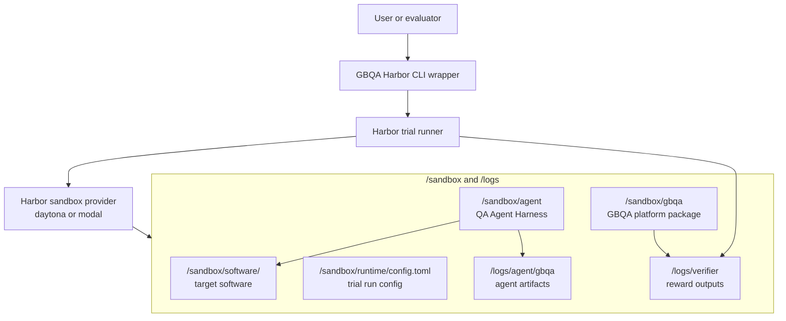
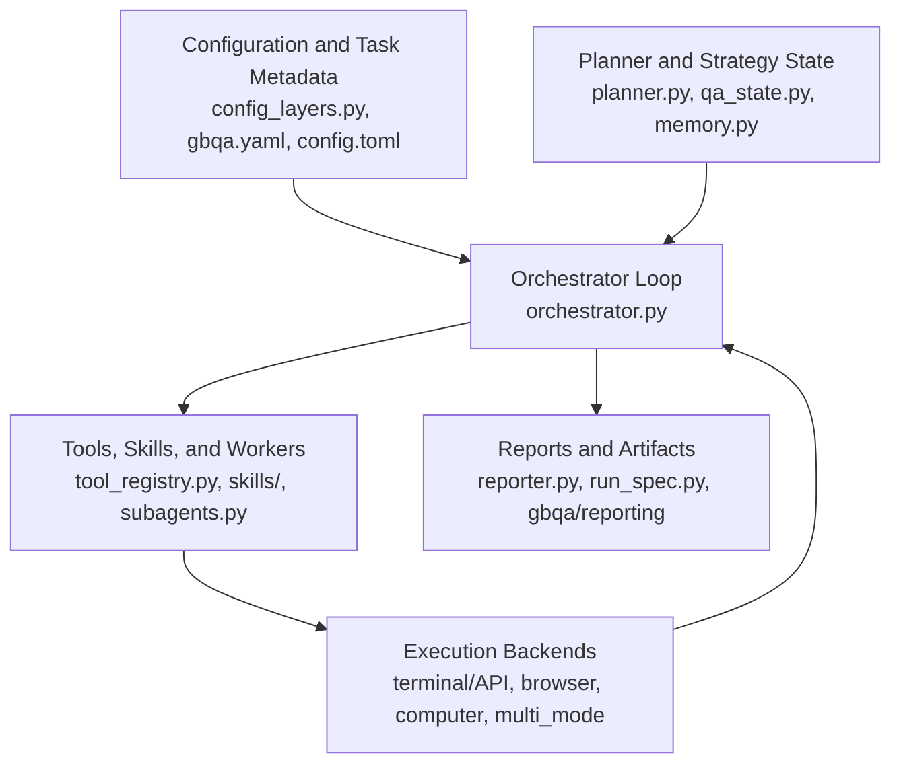
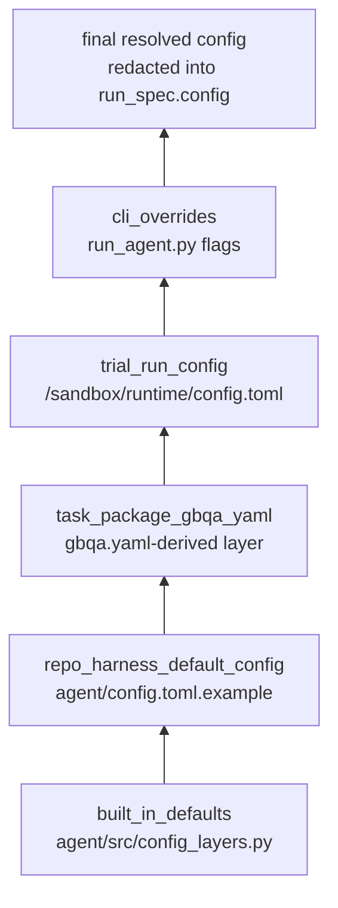
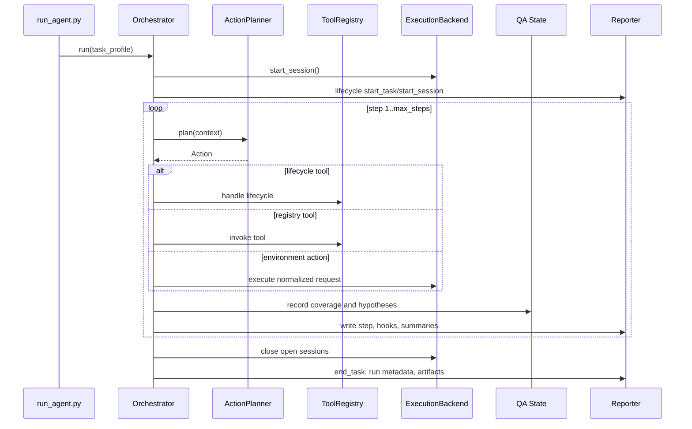

# GBQA QA Agent Harness Architecture

This document describes the current GBQA QA Agent Harness implementation under
`agent/` and its Harbor integration under `gbqa/harbor/`. It is written as an
engineering reference for maintainers who need to change the harness loop,
configuration model, tools, skills, subagents, reports, or sandbox integration.

## 1. Purpose

GBQA evaluates whether autonomous agents can discover real bugs in real software
running inside an isolated sandbox. The QA Agent Harness is the default GBQA
agent implementation. It is designed for real-world long-horizon bug discovery.

The harness should:

- Explore a live software environment through supported interaction modes.
- Maintain task/session lifecycle state over many steps.
- Track state coverage and bug hypotheses.
- Reproduce and promote suspected bugs into normalized bug reports.
- Use optional diagnostics such as logs and source inspection without making
  those capabilities mandatory in the minimal setting.
- Export stable run artifacts for verifier and benchmark analysis.
- Stay task-generic and keep task facts in task metadata.

## 2. System Context

GBQA is intentionally layered on top of Harbor instead of replacing Harbor's
task, trial, environment, and verifier lifecycle.



Runtime ownership:

- Harbor owns task packaging, trial execution, verifier execution, and artifact
  collection.
- Harbor environment providers own the remote sandbox isolation boundary. The
  validated M1 path uses `daytona`; `modal` is supported in parallel through
  Harbor's built-in Modal provider.
- GBQA owns task metadata, the QA harness behavior, normalized agent artifacts,
  and platform-level verifier-side bug evaluation.
- `agent/` owns harness execution only. It emits reports and trajectories, but
  does not read verifier target-bug files or compute benchmark scores.
- `GBQAHarborAgent` uploads the harness and GBQA package into the sandbox,
  renders `/sandbox/runtime/config.toml`, starts the target software service,
  runs `agent/run_agent.py`, and exports normalized GBQA artifacts.
- Harbor built-in `codex` and `claude-code` agents are supported as alternative
  task runners through `gbqa.cli.harbor_run` selectors. They do not run the GBQA
  QA Agent Harness; they run Harbor's CLI-agent path and must follow the task
  instruction artifact contract.

## 3. Repository Boundaries

Primary implementation paths:

- `agent/run_agent.py`: harness entrypoint and dependency wiring.
- `agent/src/orchestrator.py`: main QA loop and task/session lifecycle.
- `agent/src/execution_backends.py`: terminal, browser, computer, and multi-mode
  interaction routing over the concrete backend implementations.
- `agent/src/tool_registry.py`: planner-visible tool registry and progressive
  skill disclosure.
- `agent/src/qa_state.py`: coverage state and hypothesis manager.
- `agent/src/subagents.py`: isolated worker subagents.
- `agent/src/hooks.py`: hook policy and hook event emission.
- `agent/src/run_spec.py`: versioned run specification exported with reports.
- `agent/src/config_layers.py`: layered TOML configuration resolution.
- `agent/src/reporter.py`: raw report and trajectory export.
- `gbqa/harbor/agent.py`: Harbor custom agent wrapper.
- `gbqa/harbor/config.py`: rendered sandbox trial config.
- `gbqa/spec.py`: GBQA task metadata loading and schema.
- `gbqa/reporting/`: conversion from harness reports to normalized artifacts.
- `gbqa/rewards/`: verifier and Rewardkit integration.

Current first-party instance packages include:

- `gbqa/tasks/dark-castle-key-fragment-combine/`
- `gbqa/tasks/dark-castle-dropped-hidden-item/`
- `gbqa/tasks/dark-castle-dropped-lit-candlestick/`

Instance metadata belongs in `gbqa.yaml`; multiple instances may share the same
target software release, but each instance has one target bug, one selected
agent-facing hint, and one ground-truth golden patch anchor. Official instance
data stores weak, medium, and strong hint variants so benchmark construction can
calibrate hint strength while exposing only the selected level during a run.
`dark-castle-dropped-lit-candlestick` uses a GBQA-authored oracle patch for a
historical baseline bug rather than the upstream `v0.1.0..v0.2.0` diff.

## 4. Layered Architecture

The harness has five main layers:



Design principles:

- Keep the benchmark environment real. The agent interacts with a live target
  software environment, not a mocked problem statement.
- Keep the harness task-generic. Platform code should use task, environment,
  session, and interaction terminology.
- Use explicit policies instead of hidden behavior. Loop budgets, hooks,
  subagents, tool policy, memory, and interaction modes are configured and
  exported in `run_spec`.
- Minimize planner surface by default. Optional diagnostics are progressively
  disclosed through skills or enabled by full harness mode.
- Prefer normalized capabilities over backend-specific implementation details.
- Record enough trajectory data to make bug reports auditable.

## 5. Sandbox Providers And Layout

GBQA does not implement a cloud sandbox provider itself. The wrapper forwards
Harbor's native `-e/--env` choice, so `-e daytona` and `-e modal` use the same
task package, verifier, and `GBQAHarborAgent` code path. Task metadata records
`runtime.default_provider` and optional `runtime.supported_providers`; the
actual provider for a run is still selected by Harbor CLI arguments.

Modal runs require Modal authentication via `modal token new` or the
`MODAL_TOKEN_ID` / `MODAL_TOKEN_SECRET` environment pair. GBQA also depends on
`modal[api-proxy-support]` so hosts with proxy variables can connect to Modal's
API before sandbox creation.

Inside a remote sandbox, GBQA uses `/sandbox` as the runtime workspace:

```text
/sandbox/
  software/
    <task>/
  agent/
  gbqa/
  runtime/
    config.toml

/logs/
  agent/
    gbqa/
  verifier/
  artifacts/
```

Important paths:

- `/sandbox/software/<task>`: target GitHub software release.
- `/sandbox/agent`: uploaded QA Agent Harness.
- `/sandbox/gbqa`: uploaded GBQA platform package.
- `/sandbox/runtime/config.toml`: rendered trial config.
- `/logs/agent/gbqa`: normalized agent artifacts.
- `/logs/verifier`: Harbor-compatible reward outputs.

Do not reintroduce the old opt-based GBQA runtime root.

## 6. Configuration Model

The harness uses TOML for run configuration. YAML remains only for GBQA task
metadata such as `gbqa/tasks/<task>/gbqa.yaml`.

Configuration is resolved through explicit layers:



Precedence from highest to lowest:

1. CLI overrides, such as direct `run_agent.py` flags.
2. Trial/run config, normally `/sandbox/runtime/config.toml`.
3. Task package metadata from `gbqa.yaml`.
4. Repo harness default config, normally `agent/config.toml.example`.
5. Built-in defaults.

Harbor `--ak` values are applied before the sandbox run by rendering them into
the trial/run config. Inside the sandbox they are therefore visible through the
`trial_run_config` layer, not as direct `run_agent.py` CLI flags.

The final redacted configuration and layer provenance are exported under:

```text
run_spec.config
```

Sensitive values such as API keys, tokens, secrets, and passwords are redacted.

## 7. Interaction Profiles

The harness separates interaction exposure from backend implementation.

Supported public interaction profiles:

- `terminal`: use terminal-oriented execution through the task's declared surfaces, such as HTTP API, CLI, Python API, or shell commands.
- `browser`: use only browser interaction mode through Playwright MCP/runtime.
- `computer`: use screenshot-based GUI computer interaction mode.
- `default`: enable every interaction mode declared by task metadata.

In `default`, the task's `default_interaction_mode` is used unless
`run.interaction_mode` configures a different primary mode. When multiple modes
are enabled, the planner sees explicit mode tools:

- `terminal_action`
- `browser_action`
- `computer_action`

`terminal_action` remains the public planner-facing tool name even when the
concrete terminal surface is an HTTP API. Task metadata records whether terminal
means HTTP API, CLI, Python API, shell command, or another code-facing contract.

This avoids ambiguous natural-language mode selection inside a single generic
action string.

## 8. Harness Modes

The harness has two capability surfaces:

### Minimal Harness Mode

Minimal mode is the smallest targeted-QA setting that can explore a real
sandbox software environment, inspect source code, and report function-level
bug pinpoints.

It enables:

- Main planner/operator loop.
- Environment interaction.
- Task and session lifecycle tools.
- Coverage state.
- Hypothesis tracking.
- Code tools and code skill instructions.
- Targeted automatic code lookup after high-confidence bug findings.
- Reflection and summary policies when configured.
- Reports, traces, hooks, and verifier artifacts.

It disables by default:

- Log diagnostic tools.
- Automatic log diagnostics.
- Isolated worker subagents.
- Persistent memory carryover.

### Full Harness Mode

Full mode enables diagnostic and augmentation capabilities:

- Log tools and log skill instructions.
- Automatic log diagnostic policy.
- Isolated worker subagents.
- Diagnostic hook categories.

Full mode is intended for richer QA harness experiments and ablations, not as
the minimal baseline.

## 9. Main Loop

The main loop lives in `agent/src/orchestrator.py`.



Core loop responsibilities:

- Start the initial harness session.
- Render tool and skill capability prompt sections.
- Call the planner for one action per step.
- Execute the action through lifecycle handling, tool registry, or execution
  backend.
- Record step data, lifecycle events, hook events, coverage, hypotheses, and
  summaries.
- Trigger reflection, failure-budget handling, auto diagnostics, and subagents.
- Stop on `end_task`, terminal policy, failure budget, or max steps.
- Close every open session before recording `end_task`.

## 10. Planner, Operator, and Reflection

The harness uses separate role agents for different responsibilities:

- `ActionPlanner`: chooses exactly one next action and one tool.
- `Operator`: translates one semantic planner action into normalized backend
  calls when a backend needs lower-level execution.
- `ReflectionAnalyzer`: reviews recent behavior and can promote high-confidence
  bug evidence.
- `MemoryManager`: maintains short-term trace and long-term summary context.

The planner receives:

- Task profile.
- Long-term memory summary.
- Recent trace.
- Coverage summary.
- Hypothesis summary.
- Short subagent summary.
- Current observation.
- Available tool and activated skill section.

The planner should not assume source access, log access, browser access, or GUI
access unless those tools are explicitly visible.

## 11. Execution Backends

Execution backends implement a normalized contract:

- `start_session(run_context) -> SessionHandle`
- `describe_capabilities(session, refresh=False) -> CapabilityDescriptor`
- `execute(session, request) -> BackendExecutionResult`
- `close_session(session)`

Current backend paths:

- API backend: calls the target backend API contract directly.
- Browser backend: drives the frontend through Playwright MCP/runtime.
- Computer-use backend: drives a GUI/Cua environment through screenshot-based
  control.
- Multi-mode backend: lazily creates child sessions for each enabled mode and
  routes explicit mode tools to the correct backend.

Terminal and browser modes are the completed M1 paths. Computer interaction is wired through
metadata and config but remains experimental until GUI/Cua environment selection
is fully first-class across entrypoints.

## 12. Tools and Skills

`agent/src/tool_registry.py` owns planner-visible tools and progressive skill
disclosure.

Default planner-visible tools:

- `environment_action`
- lifecycle tools from the lifecycle skill
- `use_skill` when optional skills exist

Lifecycle tools:

- `start_session`
- `end_session`
- `new_session`
- `refresh_session`
- `switch_session`
- `list_sessions`
- `end_task`

Optional skills:

- `code`: source inspection and temporary white-box debugging tools.
- `logs`: trajectory and runtime log inspection tools.

Skills are runtime prompt and tool disclosure assets under `agent/skills/*`.
They are not passive documentation. A skill is activated when the planner uses
`use_skill`, or automatically in full mode for selected diagnostics.

## 13. QA State: Coverage and Hypotheses

QA-specific strategy state lives in `agent/src/qa_state.py`.

### Coverage State

`CoverageState` records:

- Observed state keys.
- Actions attempted per state.
- Recent failed actions.
- State/action frontier summaries.

This helps the planner avoid repeated shallow exploration and makes exploration
coverage visible in reports.

### Hypothesis Manager

`HypothesisManager` tracks suspected bugs:

- Deduplicates similar findings.
- Stores confidence and status.
- Records evidence and reproduction steps.
- Promotes high-confidence findings to reproduced status.

Sources can include:

- Planner signal.
- Bug detector.
- Reflection.
- Reproducer subagent output as supporting evidence.

## 14. Isolated Worker Subagents

Worker subagents live in `agent/src/subagents.py`. They follow the same design
idea as modern coding harness subagents: tasks that would pollute the main
planner context run in isolated worker contexts and return concise structured
summaries.

Current workers:

- `ExplorerAgent`: reviews coverage summaries and proposes state-frontier
  targets.
- `ReproducerAgent`: converts a new bug hypothesis into a reproduction plan.
- `LogAnalystAgent`: reads log-tool output and compresses log evidence.
- `CodeLocalizerAgent`: reads code-search output and suggests likely files or
  symbols.

Isolation rules:

- Each worker invocation creates a fresh LLM agent id:
  `subagent.<name>.<call>`.
- Workers do not share main planner memory.
- Workers do not receive the full trace by default.
- The main planner receives only `subagent_summary`.
- Full worker prompts and raw outputs are excluded from run metadata unless
  `subagents.record_prompts=true`.

Subagent events are recorded as hook events:

```text
hook=on_subagent_result
event_type=Ran
```

Subagents are disabled in minimal mode and enabled in full mode by default.

## 15. Logs and White-Box Diagnostics

Logs and memory are separate concepts:

- Memory is agent-side context compression and retrieval.
- Logs are source-backed diagnostics from trajectory and runtime sources.

Log diagnostics:

- `agent/src/log_sources.py`: source declarations and readers.
- `agent/src/log_types.py`: normalized log/session types.
- `agent/src/log_analyzer.py`: anomaly analysis.
- `logs` skill: planner-visible log tools.

Code diagnostics:

- `agent/src/codebase_types.py`: `UniversalCodebaseAdapter`.
- `code` skill: source inspection, search, temporary write, and restore tools.
- Rooted under `/sandbox/software` by default.

Full mode can enable automatic log analysis and code localization. When
subagents are enabled, `LogAnalystAgent` and `CodeLocalizerAgent` compress those
tool outputs before the main planner sees them.

## 16. Hooks and Trajectory Events

Hooks provide stable observability labels for harness behavior. Hook events are
written to reports and `trace.jsonl` as `type="hook"` rows.

Stable event labels include:

- `RunStarted`
- `RunEnded`
- `Planning`
- `Planned`
- `PlanFailed`
- `Explored`
- `Ran`
- `Edited`
- `Lifecycle`
- `Covered`
- `Reported`
- `Summarized`
- `Diagnosed`

Important hook names:

- `on_run_start`
- `on_run_end`
- `before_plan`
- `after_plan`
- `before_tool_call`
- `after_tool_call`
- `after_step`
- `on_lifecycle_event`
- `on_bug_reported`
- `on_coverage_recorded`
- `on_subagent_result`
- `on_auto_log_analysis`
- `on_auto_code_lookup`

Minimal mode keeps observability hooks enabled while disabling diagnostic and
context-injection hook categories. Full mode enables diagnostic hook categories.

## 17. RunSpec and Reproducibility

Every run should export a `run_spec` in report metadata. It records:

- Task id, slug, and environment id.
- Interaction profile, primary mode, enabled modes, and backend type.
- Harness mode.
- Model role configuration.
- Agent loop policy.
- Operator policy.
- Memory policy.
- Tool policy.
- Hook policy.
- Subagent policy.
- Tool and skill registry policy.
- Redacted final resolved config and configuration layer provenance.

`run_spec` is the primary surface for controlled experiments and ablations
across interaction profiles, harness modes, models, and tool policies.

## 18. Artifacts and Reports

The raw harness reporter writes per-run reports under the configured report
directory. Harbor export then normalizes those into `/logs/agent/gbqa`.

Canonical agent artifacts:

- `run.json`
- `issue.json` — preferred single issue report with top-level `report_status`, `exit_status`, `missing_fields`, and an `issue` containing `expected_behavior`, `observed_fault`, `reproduction`, and source-level `pinpoint` via `locations[]` or SWE-style `patch/diff`
- `bugs.json` — legacy single-element compatibility report
- `steps.jsonl`
- `trace.jsonl`
- `report.md`
- `artifacts/`

Target bug files store `target_bug`, including the hint, expected behavior,
observed fault, reproduction, function-level pinpoint, and golden patch anchors.

For targeted tasks, the harness runs a final fixed-format issue-report pass
before task exit. The verifier reads `report_status` first and only performs
rule-based pinpoint matching when it is `complete`. Pinpoint matching accepts
either a location naming the golden-patch function plus file/line evidence, or a
minimal patch/diff hunk that overlaps the golden patch.

Verifier outputs remain under `/logs/verifier`:

- `reward.json`
- `reward-details.json`
- `reward.txt`
- `gbqa_result.json`

The verifier reward is rule-based and binary. It evaluates one submitted issue
report for the instance and gives reward `1.0` only when the issue is complete
and its function-level pinpoint aligns with the target golden patch.

Do not move Harbor reward files or verifier outputs out of `/logs/verifier`.

## 19. Current Feature Matrix

| Feature | Minimal | Full |
| --- | --- | --- |
| Main planner/operator loop | yes | yes |
| Lifecycle tools | yes | yes |
| API interaction | yes, if profile enables it | yes, if profile enables it |
| Browser interaction | yes, if profile enables it | yes, if profile enables it |
| Computer-use interaction | experimental | experimental |
| Coverage state | yes | yes |
| Hypothesis manager | yes | yes |
| Reflection | policy controlled | policy controlled |
| Summary/memory compression | policy controlled | policy controlled |
| Code tools | yes | yes |
| Log tools | no | yes |
| Auto log analysis | no | yes |
| Auto code lookup | yes | yes |
| Worker subagents | no | yes |
| Hook observability | yes | yes |
| Diagnostic hooks | no | yes |
| Persistent memory carryover | no by default | policy controlled |

## 20. Extension Guidelines

When adding new harness capabilities:

- Add explicit config policy and include it in `run_spec`.
- Keep task-specific facts in `gbqa.yaml`, not harness code.
- Keep planner-visible tools generic and backend-agnostic.
- Prefer progressive skill disclosure for optional capabilities.
- Keep worker subagent outputs structured and concise.
- Do not feed full worker prompts or raw outputs back into the main planner by
  default.
- Preserve Harbor paths under `/logs/agent`, `/logs/verifier`, and `/sandbox`.
- Add focused tests for loop policy, run config rendering, and artifact output.

## 21. Common Execution Paths

Custom QA harness, terminal mode:

```bash
python -m gbqa.cli.harbor_run run \
  -p gbqa/tasks/dark-castle-key-fragment-combine \
  -e daytona \
  --gbqa-task-runner gbqa \
  --ak interaction_mode=terminal
```

Custom QA harness on Modal uses Harbor's `modal` environment provider with the
same GBQA artifact and verifier contract:

```bash
python -m gbqa.cli.harbor_run run \
  -p gbqa/tasks/dark-castle-key-fragment-combine \
  -e modal \
  --gbqa-task-runner gbqa \
  --ak interaction_mode=terminal
```

For Modal or Daytona infrastructure smoke, keep `--ak max_steps=10`. For a
functional targeted-bug smoke, use a larger budget such as `--ak max_steps=50`.
The default `minimal` harness includes source-code tools because nonzero
targeted reward requires function-level pinpoint evidence. Use
`--ak harness_mode=full` only when the smoke should also exercise logs,
automatic diagnostics, and worker subagents.

Default multi-mode profile:

```bash
python -m gbqa.cli.harbor_run run \
  -p gbqa/tasks/dark-castle-key-fragment-combine \
  -e daytona \
  --gbqa-task-runner gbqa \
  --ak interaction_mode=default
```

Full harness mode:

```bash
python -m gbqa.cli.harbor_run run \
  -p gbqa/tasks/dark-castle-key-fragment-combine \
  -e daytona \
  --gbqa-task-runner gbqa \
  --ak interaction_mode=terminal \
  --ak harness_mode=full
```

Harbor built-in Claude Code task runner:

```bash
python -m gbqa.cli.harbor_run run \
  -p gbqa/tasks/dark-castle-key-fragment-combine \
  -e daytona \
  --gbqa-task-runner claude-code \
  --gbqa-agent-model anthropic/claude-sonnet-4-6 \
  --gbqa-agent-auth subscription
```

Harbor built-in Codex task runner:

```bash
python -m gbqa.cli.harbor_run run \
  -p gbqa/tasks/dark-castle-key-fragment-combine \
  -e daytona \
  --gbqa-task-runner codex \
  --gbqa-agent-model gpt-5 \
  --gbqa-agent-auth subscription \
  --gbqa-codex-auth-file "$HOME/.codex/auth.json"
```

## 22. Non-Goals

The current QA Agent Harness does not:

- Replace Harbor's trial runner or verifier system.
- Treat direct `harbor run` as the stable computer interaction entrypoint.
- Assume logs are memory.
- Float benchmark baselines automatically when upstream releases change.
- Store GBQA target-bug files in the external target software repository.
